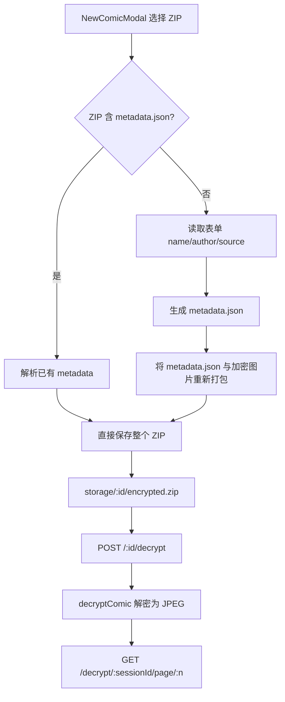

# Gallery ZIP 导入设计

Date: 2026-07-11

修复漫画画廊通过 NewComicModal 上传 batch 加密 ZIP 时被二次加密，导致解密后仍显示混淆图的问题。

---

## 1. 背景与问题

当前 `NewComicModal.vue` 允许用户选择图片或 ZIP 创建漫画。后端 `/api/gallery/create` 在收到 ZIP 后，会对 ZIP 内所有图片执行 `processImageBuffer(..., 'encrypt', 'png')`。

如果用户上传的是 ConfusePage 批量混淆后下载的 `encrypt_results.zip`（内部图片已经是加密状态），系统会再次加密，导致：

```
原始图 A → batch encrypt → E(A) 存入 ZIP
上传 ZIP 到 Gallery → 再次 encrypt → E(E(A)) 存入 storage
点击解密 → decrypt → E(A)（仍是混淆图）
```

因此画廊解密后看到的是单次加密的混淆图，看起来"完全没有解密"。

## 2. 核心决策

- **Gallery 只接收 ZIP**，不再接收单张/多张图片
- **ZIP 是已加密的漫画包**，导入时不应再做像素变换
- **ZIP 含 `metadata.json`** → 直接导入，使用已有元数据
- **ZIP 不含 `metadata.json`** → 视为 batch 加密结果，自动补写 `metadata.json` 后保存
- **ConfusePage 保持原有逻辑**：上传原始图片混淆，或上传加密 ZIP 解混淆

## 3. 数据流



## 4. 后端变更

### 4.1 `/api/gallery/create`

**请求：** `multipart/form-data`

| 字段 | 类型 | 必填 | 说明 |
|---|---|---|---|
| `zip` | file | 是 | 加密 ZIP 文件 |
| `name` | string | 条件必填 | ZIP 不含 metadata.json 时必填 |
| `author` | string | 否 | 默认空字符串 |
| `source` | string | 否 | 默认空字符串 |

**处理流程：**

1. 校验 `zip` 字段存在
2. 解压 ZIP
3. 检测是否存在 `metadata.json`
4. 若存在：
   - 解析 `metadata.json`
   - 直接保存原 ZIP（不再重新打包）
   - 返回 `{ id, name: existingMeta.name, totalPages }`
5. 若不存在：
   - 校验 `name` 存在
   - 提取图片文件（`page_*.png/jpg` 或常见图片扩展名）
   - 按文件名排序，统一重命名为 `page_001.png`、`page_002.png`...
   - 构建新的 `metadata.json`
   - 将 `metadata.json` 与重命名后的图片打包为新 ZIP
   - 保存并返回 `{ id, name, totalPages }`

### 4.2 `metadata.json` 结构

```json
{
  "name": "漫画名称",
  "author": "作者",
  "source": "图源",
  "createdAt": "2026-07-11T00:00:00.000Z",
  "coverIndex": 0
}
```

### 4.3 不再二次加密的规则

- 导入流程**不调用** `processImageBuffer(..., 'encrypt', ...)`
- 图片 buffer 保持原样，不重编码
- 仅做两件事：补写 metadata、统一页面文件名

## 5. 前端变更

### 5.1 `NewComicModal.vue`

- 文件输入框改为：`<input type="file" accept=".zip">`
- 移除 `multiple` 属性
- 文案改为"上传加密 ZIP"
- 选择 ZIP 后，本地读取检测是否含 `metadata.json`
  - 若含：禁用 `name` 输入框，显示"已检测到漫画元数据，将直接导入"
  - 若不含：`name` 必填
- 提交字段：仅 `zip`、`name`、`author`、`source`

### 5.2 `GalleryPage.vue`

- 无需改动

### 5.3 `ComicDetailPage.vue`（可选）

- 当前封面显示为占位符"封面"
- 后续可接入后端返回的 `coverBase64` 显示真实封面（不在本次范围内）

## 6. 错误处理

| 场景 | 前端行为 | 后端响应 |
|---|---|---|
| 未上传 ZIP | 提示"请上传 ZIP 文件" | — |
| ZIP 不含 metadata 且未填 name | 提示"请输入漫画名称" | 400 |
| ZIP 解压失败 | 提示"ZIP 文件损坏" | 400 |
| ZIP 内无图片 | 提示"ZIP 内未找到图片" | 400 |
| metadata.json 解析失败 | 提示"元数据损坏" | 400 |
| 保存失败 | 提示"保存失败" | 500 |

## 7. 文件变更清单

| 文件 | 操作 | 说明 |
|---|---|---|
| `src/server/gallery-routes.ts` | 修改 | 重构 `/api/gallery/create` 的 ZIP 处理逻辑 |
| `src/client/components/gallery/NewComicModal.vue` | 修改 | 限制只接受 ZIP，检测 metadata.json，条件必填 name |
| `src/server/gallery-routes.test.ts` | 修改 | 新增/调整测试用例 |
| `docs/superpowers/specs/2026-07-11-gallery-zip-import-design.md` | 新增 | 本设计文档 |

## 8. 测试计划

### 单元/集成测试

| 测试 | 文件 | 内容 |
|---|---|---|
| 上传含 metadata.json 的 ZIP | `gallery-routes.test.ts` | 直接导入，返回已有名称，不二次加密 |
| 上传不含 metadata.json 的加密 ZIP | `gallery-routes.test.ts` | 补写 metadata，保存后解密显示正常 |
| 上传不含 metadata.json 且未填 name | `gallery-routes.test.ts` | 返回 400 |
| 上传损坏 ZIP | `gallery-routes.test.ts` | 返回 400 |
| 上传无图片 ZIP | `gallery-routes.test.ts` | 返回 400 |
| 解密导入后的漫画 | `gallery-storage.test.ts` | 解密后像素与原始图接近 |

## 9. 兼容性

- 已有通过 `/api/gallery/create` 上传原始图片创建的漫画：不受影响，历史数据仍可正常解密
- 通过 `/save-from-batch` 保存的漫画：不受影响
- 未来 Gallery 仅用于导入/管理已加密的漫画 ZIP

## 10. 第一性原理检查

- **像素 + 空间填充曲线 → 重排列 → 图片**：Gallery 只负责存储和展示已加密的漫画包，不应对已有加密像素再次变换
- **encrypt 产出 ZIP，decrypt 消费 ZIP**：Gallery 接收的是 encrypt 产物，消费时通过 decrypt 还原
- **隔离清晰**：ConfusePage 负责原始图片的混淆/解混淆，Gallery 负责漫画包管理
